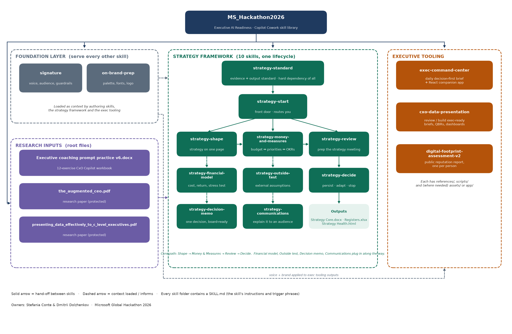

# MS_Hackathon2026 — Executive AI Readiness

**Microsoft Global Hackathon 2026**

Owners and developers: **Stefania Conte** and **Dmitrii Dolzhenkov**

A library of Copilot Cowork skills that help senior leaders discover, experience and adopt executive-specific uses of agentic AI. These skills **augment** a leader's ability to sense, judge, direct and govern across the organisation; they do not duplicate the work already delegated.

---

## Table of contents

1. [The problem we started from](#1-the-problem-we-started-from)
2. [What this repo is](#2-what-this-repo-is)
3. [How to navigate the repo](#3-how-to-navigate-the-repo)
4. [Repository structure (visual)](#4-repository-structure-visual)
5. [Folder-by-folder guide](#5-folder-by-folder-guide)
6. [The skills in detail](#6-the-skills-in-detail)
7. [How the skills work together](#7-how-the-skills-work-together)
8. [Anatomy of a skill folder](#8-anatomy-of-a-skill-folder)
9. [Design principles shared by every skill](#9-design-principles-shared-by-every-skill)
10. [Research inputs](#10-research-inputs)
11. [Team](#11-team)

---

## 1. The problem we started from

Senior leaders can learn to use Copilot as a thinking partner because it supports activities they already recognise as their own: exploring ideas, testing assumptions, reviewing information and preparing decisions.

**Copilot Cowork creates a different adoption challenge.** Advanced personal AI tools like Cowork can carry out multi-step work, create deliverables, monitor activity and move work forward on the user's behalf. However, senior leaders already operate through delegation. Executive assistants, chiefs of staff, leadership teams and specialist functions perform much of this work for them.

As a result, the standard value proposition of advanced AI — *"it does the work for you"* — may appear less relevant to executives than to individual contributors. Leaders may struggle to identify what they should personally use Cowork for, what should remain delegated to employees, and where AI can provide value that their existing support structures do not.

Yet these are the same leaders expected to make decisions about AI strategy, investment, adoption and governance. They need first-hand experience of what advanced AI can do, where it fails, how it should be directed and how it can work alongside human teams.

### The hackathon challenge

> **How might we help senior leaders discover, experience and adopt executive-specific uses of Copilot Cowork that augment, rather than duplicate, the work already delegated to their people?**

### The Executive Agentic AI Paradox

> The people who most need to understand agentic AI may see the least immediate reason to use it, because they already have human systems that act on their behalf.

### Our hypothesis

> The highest-value executive uses of Copilot Cowork will not simply automate tasks already performed by employees. They will improve the leader's ability to **sense, judge, direct and govern** across the organisation.

Every skill in this repo is a test of that hypothesis.

---

## 2. What this repo is

This is **not a single application**. It is a collection of **15 Copilot Cowork skills**, plus the research that shaped them. A skill is a folder containing a `SKILL.md` file (the instructions Copilot follows, the phrases that trigger it, and its guardrails) and optionally supporting references, scripts, templates and assets.

The skills fall into three groups:

| Group | Skills | What they do for a leader |
|---|---|---|
| **Foundation layer** | `signature`, `on-brand-prep` | Make every output sound like the leader and look like their organisation. Loaded as context by all other skills. |
| **Strategy framework** | `strategy-start`, `strategy-standard`, `strategy-shape`, `strategy-money-and-measures`, `strategy-review`, `strategy-decide`, `strategy-financial-model`, `strategy-outside-test`, `strategy-decision-memo`, `strategy-communications` | A full lifecycle for owning a strategy: get it onto one page, check the money follows it, prepare the review meeting, decide whether it still holds, and explain it to each audience. |
| **Executive tooling** | `exec-command-center`, `cxo-data-presentation`, `digital-footprint-assessment-v2` | A daily decision-first brief with a companion app, an exec-readiness reviewer for briefs, QBRs and dashboards, and a public-reputation assessment for a leader or a leadership team. |

---

## 3. How to navigate the repo

**If you have five minutes:**
1. Read [section 1](#1-the-problem-we-started-from) above for the problem.
2. Look at the [diagram](#4-repository-structure-visual) to see how the pieces fit.
3. Open `strategy-start/SKILL.md` — it is the "front door" of the largest component and explains the framework in plain words.

**If you want to understand one skill:**
- Open its folder and read `SKILL.md` top to bottom. Every skill follows the same layout: a description with trigger phrases, *When to use* / *When NOT to use*, a step-by-step workflow, output format, failure handling and guardrails.
- Then look at `references/` for the detailed rules the workflow points to, and `scripts/` for any validation or rendering helpers.

**If you want to understand the strategy framework as a whole:**
- Start at `strategy-start/SKILL.md` (orientation and routing).
- Then `strategy-standard/SKILL.md` — the evidence and presentation standard every other `strategy-*` skill must load before doing anything. It also carries the shared working files and the health-dashboard format.
- Then follow the core path: `strategy-shape` → `strategy-money-and-measures` → `strategy-review` → `strategy-decide`.

**If you want to see the app code:**
- `exec-command-center-skill/app/` is a React 19 + Vite + Tailwind + shadcn/ui project. `app/BOOTSTRAP.md` explains the mock-up and build phases; `app/src/` holds the components.

**If you want the research behind it:**
- The three files at the repo root (a `.docx` workbook and two `.pdf` papers) — see [section 10](#10-research-inputs).

---

## 4. Repository structure (visual)



**Legend:** solid arrow = hand-off between skills; dashed arrow = context loaded / informs. Every skill folder contains a `SKILL.md`.

---

## 5. Folder-by-folder guide

```
MS_Hackathon2026/
│
├── README.md
├── repo-structure.png                                ← the structure diagram shown above
├── Executive coaching prompt practice v6.docx        ← 12-exercise CxO Copilot workbook (research input)
├── the_augmented_ceo_*.pdf                           ← research paper (research input)
├── presenting_data_effectively_to_c_level_executives_*.pdf   ← research paper (research input)
│
│   ── FOUNDATION LAYER ──
├── signature/                    Stores and serves the leader's voice, audience modes and never-say list
│   ├── SKILL.md
│   └── references/               consumption-contract.md · profile-template.md · voice-sampling.md
│
├── on-brand-prep/                Extracts a company's palette, fonts and logo; serves a brand brief to any authoring skill
│   ├── SKILL.md
│   ├── extract_theme.py          pulls theme colours/fonts from pptx/docx/xlsx
│   ├── apply_brand_to_app.py     patches the Exec Command Center app theme
│   └── *.md                      brand-brief, brand-template, design-principles, extraction-recipes, app-theming
│
│   ── STRATEGY FRAMEWORK ──
├── strategy-start/               Front door: explains the framework, works out what you have, routes you
├── strategy-standard/            Evidence + presentation standard; hard dependency of every strategy-* skill
├── strategy-shape/               Gets a strategy onto one page (greenfield or brownfield)
├── strategy-money-and-measures/  Traces budget and initiatives to priorities; tests OKRs
├── strategy-review/              Prepares the strategy meeting around exceptions and open decisions
├── strategy-decide/              Persist / adapt / stop verdict on the strategy itself
├── strategy-financial-model/     Cost, return and stress-test scenarios per priority
├── strategy-outside-test/        Tests external assumptions (market, competitors, regulation) against evidence
├── strategy-decision-memo/       Works one decision against the strategy into a board-ready memo
├── strategy-communications/      Turns the agreed strategy into a message for one audience (drafts only)
│   └── (each folder)             SKILL.md only — all shared files and templates are defined in strategy-standard
│
│   ── EXECUTIVE TOOLING ──
├── exec-command-center-skill/    Guided install of a personal daily decision-first brief + companion app
│   ├── SKILL.md
│   ├── app/                      React 19 + Vite + Tailwind + shadcn/ui companion app (App Builder scaffold)
│   │   ├── BOOTSTRAP.md          mock-up phase → build phase instructions
│   │   ├── package.json
│   │   └── src/                  App.tsx, meeting-brief-panel.tsx, brief-store.ts, mock-brief.json, UI primitives …
│   ├── references/               brief-schema.json · design-principles.md · guardrails.md · meeting-brief.md · section-playbooks.md
│   ├── scripts/validate_brief.py validates a brief JSON against the schema before it is written
│   └── templates/                brief.example.json · brief.sample.json · config.template.json · mockup-guide.md · schedule.prompt.md
│
├── cxo-data-presentation/        REVIEW or BUILD material a senior executive must decide from
│   ├── SKILL.md
│   ├── assets/                   dashboard-shell.html · document-shell.html · decision-card.schema.json · decision-paper-template.docx
│   ├── references/               audience-lenses · chart-selection · checks · citations · design-system · frameworks
│   │                             · output-contracts · playbook-dashboard · playbook-decision-paper · playbook-presentation · playbook-qbr
│   └── scripts/contrast_check.py accessibility contrast check for status colouring
│
├── digital-footprint-assessment-v2/   Public digital-footprint and reputation assessment, one report per person
│   ├── SKILL.md
│   ├── brand/                    default.json · kerry.json (report branding)
│   ├── fixtures/                 jane-murphy/ sample subject, subjects.json, run.json, make_fixture.py
│   ├── references/               data-contracts.md · image-capture.md · report-spec.md
│   ├── schemas/                  assets · report · subjects JSON schemas
│   ├── scripts/                  plan_research, plan_capture, capture_crop, image_qc, dedupe_hash, render_html,
│   │                             render_docx.js, render_pages, accept_*, preflight, selftest, validate_json …
│   └── skill-quality-report.*    automated quality score for the skill (Excellent, 93/100)
│
└── digital-footprint-assessment/      Earlier iteration of the skill above — superseded by v2
```

---

## 6. The skills in detail

### Foundation layer

#### `signature`
Stores and serves the leader's professional identity, voice and guardrails so every other skill sounds like them. Runs a short first-run interview (max five questions), samples the leader's real writing for voice, keeps **one** human-editable profile file, and serves it to authoring skills through a *consumption contract*. Supports conversational edits ("stop saying X", "make exec summaries shorter") and lightweight drift capture over time.
**Try:** *"set up my Signature"*, *"show my profile"*, *"change my tone"*.

#### `on-brand-prep`
Extracts a company's visual brand — palette, fonts, logo — from a branded file (pptx, docx, xlsx, PDF, image) or a website, confirms it with a swatch, and saves one profile per company. It then serves a brand brief plus executive-grade design rules to whatever builds the deck, document, spreadsheet, dashboard or app. Step 8 patches the Exec Command Center app theme directly.
**Try:** *"brand it like <company>"*, *"extract the brand from <url>"*, *"apply the <company> brand to the app"*.

### Strategy framework

The framework answers **five questions** a leader asks about their strategy, and produces **three files** the leader owns: `Strategy Core.docx` (one page — the only artefact the CEO personally owns), `Strategy Registers.xlsx` (the working lists) and `Strategy Health.html` (the dashboard).

| # | Question | Skill |
|---|---|---|
| 1 | What is this and where do I begin? | `strategy-start` |
| 2 | What is our strategy, and does it hold together? | `strategy-shape` |
| 3 | Does our money and do our measures match what we said? | `strategy-money-and-measures` |
| 4 | What needs my attention before the meeting? | `strategy-review` |
| 5 | Does this still make sense? | `strategy-decide` |

The framework needs five inputs, in the leader's own words — **the plan** and **resources** are the floor; the initiative registry, scorecard and execution status make the answers sharper. Nothing is searched for; the leader points at the files.

#### `strategy-start`
The front door. Explains the framework in under 200 words, checks whether a strategy core already exists, asks two questions (do you have a written strategy? what do you want to do first?) and routes to the right skill, naming the input it needs. Also briefs someone new on a strategy already set up. Produces no analysis of its own.
**Try:** *"where do I start with strategy"*, *"what can I do now"*, *"brief me on our strategy"*.

#### `strategy-standard`
The evidence and presentation standard behind every strategy output: how claims are sourced, how facts are kept apart from assumptions and estimates, what every output must contain, who signs what, and how anything is presented to an executive. Carries the shared working files, the input requirements of every skill, and the health-dashboard format. **Hard dependency** — every other `strategy-*` skill loads it first.
**Try:** *"is this good enough to go to the board"*, *"check the evidence behind this"*.

#### `strategy-shape`
Gets a strategy onto one page — writing one from scratch (greenfield) or pulling together one scattered across a board deck, a budget and a dozen slides (brownfield). Names the one real problem, checks the approach rules something out, flags actions that answer nothing, and shows the gap between the strategy written down and the strategy the spending reveals.
**Try:** *"help me get this onto one page"*, *"is this actually a strategy or just a list of goals"*.

#### `strategy-money-and-measures`
Traces every budget line and every initiative back to a priority, names what answers to nothing, compares what each priority was promised against what it was funded, and tests objectives and key results for baselines, owners, counter-measures and pairs that fight each other.
**Try:** *"where is our money actually going"*, *"do our OKRs match the strategy"*.

#### `strategy-review`
Prepares the strategy meeting around exceptions and open decisions, not a full status report: what changed since last time, what is off track, which decisions are open and who owns each, what is overdue. Refreshes the strategy health dashboard.
**Try:** *"what actually needs my attention"*, *"get me ready for the strategy meeting"*.

#### `strategy-decide`
Puts the strategy itself on the table: what it quietly assumed, whether each assumption survived contact with reality, whether a failing action or a wrong problem is to blame — and returns a **persist / adapt / stop** recommendation with the evidence behind it.
**Try:** *"does this still make sense"*, *"should we kill this"*, *"which of our assumptions have broken"*.

#### `strategy-financial-model`
Puts the strategy into money and stress-tests it: what each priority costs and returns, how the envelope behaves period by period, and what happens under a funding cut, a delivery slip, a cost shock or a demand miss. Shows which key results lose their backing first.
**Try:** *"what if we cut 10 per cent"*, *"model the downside"*.

#### `strategy-outside-test`
Tests what the strategy assumes about the outside world — market, competitors, customers, regulation, technology, cost — against current evidence, and reports which assumptions have stopped being true, which are close to breaking, and which nobody can check.
**Try:** *"has the market moved"*, *"is our read on the competition still right"*.

#### `strategy-decision-memo`
Takes one decision and works it against the strategy: does it answer the problem, what does it displace, what would have to be true, what is the credible alternative, and what is the strongest case against. Returns a memo a board or executive committee can decide from.
**Try:** *"should we do X or Y"*, *"write me a decision memo"*.

#### `strategy-communications`
Turns the agreed strategy into something one audience will understand — the all-hands, the board, investors, one function, new joiners — without adding a single fact the strategy does not already carry. **Drafts only, never sends.**
**Try:** *"write the all-hands version of our strategy"*, *"what do I tell investors about this"*.

### Executive tooling

#### `exec-command-center`
A guided install of a personal Exec Command Center. It **always** starts by introducing what it will read, write and never do, and asks before acting. It then builds a personalised mock-up of the companion app for the leader to refine, and only on their say-so binds mail, calendar, Teams and directory, runs the first decision-first daily brief, and schedules the morning run. The daily run reads the last seven days of state, checks calendar completeness, reads sent items before writing decisions, builds a brief for every meeting, validates the JSON against `references/brief-schema.json`, and writes `brief-YYYY-MM-DD.json` plus `latest.json` to the leader's OneDrive. The companion app renders `latest.json`. Write-back is drafts only — it never sends, posts, accepts, declines or moves anything.
**Try:** *"/exec-command-center"*, *"set up a daily CEO brief"*, *"build my exec command center"*.

The **companion app** (`app/`) is React 19 + Vite + Tailwind + shadcn/ui, scaffolded for App Builder. It ships generic — no customer names, fixed counts or connection IDs; everything is derived from the loaded brief. Key files: `src/App.tsx`, `src/meeting-brief-panel.tsx`, `src/brief-store.ts` (toggle `MOCK_MODE`), `src/mock-brief.json`, `src/theme.ts` (Auto · Light · Dark · Warm). `app/BOOTSTRAP.md` documents the two-phase install: mock-up (mock connectors, in-memory actions, MOCK-UP banner) then build (bind OneDrive for Business and Office 365 Users connectors, remove mocks, publish).

#### `cxo-data-presentation`
Reviews or builds material that asks a senior executive to decide: exec briefs, decision cards, QBR packs, board papers, executive dashboards, and chart choice for an executive comparison. **REVIEW** returns a named gap list, never a rewrite. **BUILD** produces the smallest stake-proportional artefact. It detects the artefact type, sizes the stake, picks the audience lens (CEO-board, CFO, CIO-CTO, sales exec, COO-risk) and routes to a decision card, HTML shell, docx or pptx. Progressive disclosure: only the playbook for the detected artefact type is loaded.
**Try:** *"is this exec-ready"*, *"review this before the QBR"*, *"does this land with a CFO"*, *"which chart for this comparison"*.

#### `digital-footprint-assessment-v2`
An independent public digital-footprint and reputation assessment of one named person or a roster (leadership team, board, spokespeople), from public web sources retrieved during the run. One Word + HTML report per person: a one-page card (headline finding, key figures, six-dimension scorecard, three fixes) over a sourced evidence pack — career, appearances, quotes, media, social, photographs, network and title variants. The workflow runs research in parallel (max four agents), captures images strictly serially, QCs and renders, and **never publishes red** — a gate check and a mandatory visual QA of the Word file precede publishing. It is explicitly *not* for evaluating job performance, ranking people or researching private life.
**Try:** *"digital footprint of X"*, *"how does our leadership team show up online"*, *"what photos of X are public"*.

> `digital-footprint-assessment/` (without `-v2`) is the earlier iteration and is kept for reference only. Use v2.

---

## 7. How the skills work together

**Foundation first.** `signature` and `on-brand-prep` do not author anything. They store a profile — the leader's voice and the company's look — and serve it as context to whichever skill is doing the writing. Every deck, document, dashboard or app the other skills produce can consume both.

**The strategy framework is a lifecycle, not a toolbox.** `strategy-start` is the only entry point; `strategy-standard` is loaded by every other skill before any search, read or drafting. The core path is:

```
strategy-shape  →  strategy-money-and-measures  →  strategy-review  →  strategy-decide
 (one page)          (does the money follow?)       (what needs me?)   (persist / adapt / stop)
```

Four more skills plug in along the way: `strategy-financial-model` when the question is cost and downside, `strategy-outside-test` when the question is the outside world, `strategy-decision-memo` when a single decision needs a paper, and `strategy-communications` once the strategy is agreed and needs telling. Each skill's `SKILL.md` names its own *When NOT to use* and hands off to the right neighbour.

**The executive tooling stands alone but shares the same standards.** `exec-command-center` covers the daily rhythm; `cxo-data-presentation` covers the moment a leader has to decide from someone else's material; `digital-footprint-assessment-v2` covers how the leader and their team are seen from outside. All three apply the leader's `signature` voice and, where a customer is involved, the `on-brand-prep` brand.

---

## 8. Anatomy of a skill folder

Every skill follows the same shape, which makes the repo easy to navigate once you have read one:

```
<skill-name>/
├── SKILL.md            The skill. YAML front matter (name, description with trigger phrases, category, icon)
│                       then: Overview · When to use · When NOT to use · Workflow / Core instructions ·
│                       Output format · Failure handling · Guardrails · Handoff
├── references/         Detailed rules the workflow points to, loaded only when needed (progressive disclosure)
├── scripts/            Validation, rendering or QC helpers (Python, occasionally JS)
├── assets/ templates/  Shells, schemas, sample data and document templates
└── skill-quality-report.{json,html}   (where present) automated quality score for the SKILL.md
```

The `description` in the front matter is what Copilot uses to decide whether a skill should trigger — that is why each one lists concrete phrases a leader would actually say and an explicit *Do NOT use for…* clause.

---

## 9. Design principles shared by every skill

These recur across every `SKILL.md` in the repo and are the practical expression of the hypothesis in section 1:

- **Augment judgement, don't replace delegation.** Skills sense, test, structure and prepare; they do not send, post, accept, decline or move anything on the leader's behalf. Communications are drafts. Write-back is opt-in and drafts-only.
- **Introduce, then ask, then act.** The exec command center always opens by saying what it will read, write and never do, and waits for agreement.
- **Evidence or silence.** Every claim traces to a source. `No issues found` and `could not look` must never read the same. A missing input is named as missing, never bridged from memory or another period.
- **Facts, assumptions and estimates are kept apart** and labelled as such.
- **Smallest stake-proportional artefact.** A review returns a gap list, not a rewrite; a build produces the lightest thing that lets the leader decide.
- **Progressive disclosure.** Load only the reference or playbook the current situation needs.
- **Never publish red.** Quality gates and visual QA run before anything reaches the leader.
- **Privacy by default.** Personal calendar items are masked; no skill evaluates job performance, ranks people or researches private life.

---

## 10. Research inputs

Three files at the repository root shaped the skills. They are inputs, not deliverables.

| File | What it is |
|---|---|
| `Executive coaching prompt practice v6.docx` | A Copilot white-glove session workbook for senior leaders: twelve exercises structured as a realistic CxO decision journey — configuring an *Executive Chief of Staff* persona, executive signal scan, meeting brief, multi-lens proposal stress test, competitive lens review, stakeholder and adoption risk map, organisation design, strategy-to-execution plan, dataset analysis, communicating the decision, strategic post-mortem, and ideation. Many of the skills above are the productised form of these exercises. |
| `the_augmented_ceo_*.pdf` | Research paper on how advanced AI augments the CEO role. |
| `presenting_data_effectively_to_c_level_executives_*.pdf` | Research paper on presenting data to C-level executives — the basis for `cxo-data-presentation`. |

---

## 11. Team

| | |
|---|---|
| **Stefania Conte** | Owner and developer |
| **Dmitrii Dolzhenkov** | Owner and developer |
| **Micheal McGrath** | Contributor |

Built for the **Microsoft Global Hackathon 2026**.
